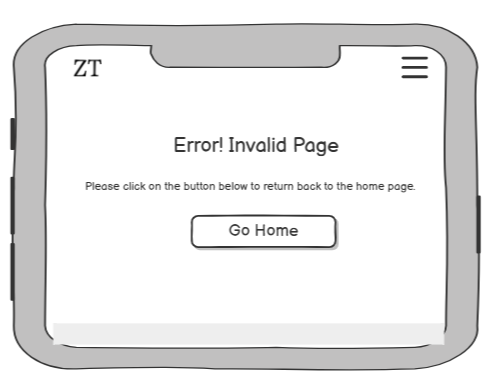

# Zanzibar Tours

Zanzibar Tours is a reputable tour agency dedicated to providing memorable tourism experiences for visitors to Zanzibar, and local residents in nearby regions.

On this website, users will immediately recognize our reputation and credibility via customer testimonials and the dedicated "About Us" section. High resolution visuals of Zanzibar’s breathtaking beaches, forests, and other scenic locations are showcased in an engaging image carousel and on our "Packages" page.

For inquiries, users can contact us using the contact infomation in the footer, which includes contact details and social media links. Additionally, the Booking Section offers a direct way for users to message us.

[View the live site here.](https://hannamussa.github.io/zanzibartours/)

## UX

From the first click, users should immediately recognize that the website focuses on Zanzibar tours. This is accomplished with a full-width, autoplaying carousel designed to capture attention. High-resolution images are used to enhance visual appeal and create an engaging experience.

### Color Scheme

[Image picker](https://imagecolorpicker.com/) was used to generate a color palette. The color scheme follows a clean and modern style that complements the websites color palette. The key colors include:

- Headings were styled in `tertiary-color: #0c5c59`, providing a strong yet elegant contrast.
- Navigation links & footer icons used `primary-color: #2f2a30` for a refined, cohesive look.
- Button hover effects adopted `secondary-color: #f2e9d5`, enhancing interactivity.
- Hovered buttons and social links featured the `highlight-color: #30bbb4` for emphasis.

### Typography

- [Lato](https://fonts.google.com/specimen/Lato) was selected as the primary font for the body text.

- [Playfair Display](https://fonts.google.com/specimen/Playfair+Display) was used for headings and subheadings.

- [Sans-serif](https://fonts.google.com/?query=sans-serif) was used as a fallback font in case the other fonts fails to load.

Lato was chosen for its readability and clarity, while Playfair Display, commonly used on luxury websites, provides a blend of traditional and modern aesthetics. The contrast between Lato and Playfair Display creates a visually appealing and well-balanced typographic combination.

### New Site Users

- As a new user I would like to understand the purpose of this site for ease of convenience.
- As a new user, I would like to easily navigate the site, as this would be user-friendly and convenient.
- As a new user, I would like to contact the owner and view their opening hours so I can contact them and discuss any questions.
- As a new user, I would like to book a tour for convenience.
- As a new user, I would like to view visuals of Zanzibar Tours to know what I will be expecting.
- As a new user, I would like to get detailed information on available tours with scenic visuals to know what I will be expecting.
- As a new user, I would like to find social media pages for contact purposes.
- As a new user, I would like to view the site on any device, as this would be a good user experience and convenient.
- As a new user, I would like to read testimonials from previous visitors to get an idea of the credibility of the company.

### Existing Site Users

- As an existing user, I would like to stay updated and get notified about new features, events, and announcements to see if I would like to attend any tours.
- As an existing user, I would like to see any tours available with their costs so that I can calculate the feasibility before booking.

### Site Admin Users

- As an admin user, I should be able to respond to user enquiries to build a good reputation and for reliability.
- As an admin user, I want to add, edit, or remove tour listings so that the website always displays up-to-date offerings to provide a good user experience.
- As an admin user, I should be able to oversee site performance, detect issues, and debug any issues for a good user experience.
- As an admin user, I should have correct indentation for easy readability and editing.

## Wireframes

Wireframes were developed usng Balsamiq for mobile, tablet and desktop sizes.

### Mobile Wireframes

Click here to view the Mobile Wireframes

- **Home Page**  
  

- **Packages Page**  
  

- **Booking Page**  
  

- **Error Page**  
  

### Tablet Wireframes

Click here to view the Tablet Wireframes

- **Home Page**  
  

- **Packages Page**  
  

- **Booking Page**  
  

- **Error Page**  
  

### Desktop Wireframes

Click here to view the Desktop Wireframes

- Home Page  
  

- Packages Page  
  

- Booking Page  
  

- Error Page  
  

## Features

### Existing Features

- **Navbar**

  - The navbar is fixed to the top of each page, allowing users to navigate easily, without having to scroll to the top.
  - The website features a consistent navigation bar across all pages, providing users with easy access to key sections. The navigation bar includes the following links: Home, About, Packages, Contact, and Book Now.

    - 'Home' serves as the main page.
    - 'About' and 'Contact' are sections within the Home page, and clicking their respective links will scroll users directly to those sections.
    - 'Packages' directs users to a dedicated Packages page.
    - 'Book Now' redirects users to the booking page.

  - The website's logo is positioned on the left side of the navigation bar, while the links are aligned to the right.
    
  - The navigation bar is fully responsive. On desktop screens, the links are displayed openly, whereas on tablets and mobile devices, the navbar collapses into a button with a dropdown menu. The logo remains on the left side across all screen sizes.
    

- **Footer**

  - The footer appears at the bottom of every page, extending across the full width of the screen. It includes contact information, social media links, opening times, and a newsletter subscription.
    

- **Home page**

  - The header on the main page features a responsive, autoplaying carousel with three slides, each showcasing scenic images of Zanzibar. The autoplaying carousel spans the full width of the screen and includes a header, a short paragraph, and a button that links users to the Packages page.
    

  - The About section features an image alongside a brief description of Zanzibar Tours, highlighting its offerings. On mobile and tablet screens, the image and description stack vertically, while on desktop screens and larger, the section spans the full width of the screen.
  - The Testimonial section includes six reviews from past customers and is fully responsive.
    - On mobile screens, testimonials stack vertically, with each one occupying the full width.
    - On tablets, two testimonials are displayed per row.
    - On desktop screens and larger, three testimonials are displayed per row, spanning the full width of the section.
      

- **Package page**

  - The Packages page consists of twelve cards, each showcasing an image of the tour's scenic views, a brief description of the experience, and a footer section with a button that links to the booking form, allowing users to book a tour.
  - An embedded YouTube video is positioned at the bottom of the page. The video is set to autoplay while muted, includes playback controls for user convenience, and offers the option to open directly on YouTube by clicking the YouTube icon.
  - The layout is fully responsive:
    - On mobile screens, one package card takes up the full width.
    - On tablet-sized screens, two cards are displayed per row, spanning the entire width.
    - On large screens, four package cards are displayed per row, utilizing the full screen width.
      
    - The embedded video maintains a consistent layout across all screen sizes.

- **Booking page**

  - The Booking page features a form that allows users to inquire about a tour. To submit the form, users must provide their phone number, email, and selected tour type, as these fields are required. Upon successful submission, users are redirected to the confirmation page. The booking page maintains a consistent layout across all devices.
    

- **Confirmation page**

  - The Confirmation Page appears after users submit the booking form. A button is displayed, allowing users to return to the home page. The confirmation page maintains a consistent layout across all devices.
    

- **Error 404 page**

  - The 404 Error Page is shown when a user attempts to access a non-existent page. Like the Confirmation Page, it features a button that allows users to return to the home page and maintains a consistent layout across all devices.
    

### Future Features

These are potential future features for the website:

- **FAQ Page**

  - A dedicated page providing quick answers to common user or customer inquiries. It would help clarify details about bookings, tours, services, and other relevant information.

- **Embedded iFrames**

  - Integrating iFrames would allow users to visualize locations more easily. This feature would display tour meeting points, destinations, and routes, making the website more interactive and informative.

- **Gallery Page**
  - A visually engaging page showcasing high-resolution images of tour locations, attractions, and experiences. This would enhance the site's appeal, improve user experience, and add authenticity.

## Tools and Technologies Used

This section includes the tools, technologies, and frameworks used in the development of the website.

- [Google Chrome](https://www.google.com/chrome/), [Microsoft Edge](https://www.microsoft.com/edge), [Mozilla Firefox](https://www.mozilla.org/firefox/), [Opera](https://www.opera.com/) and [Brave](https://brave.com/) was used for testing the website to ensure compatibility across different devices.
- [Chrome Dev Tools](https://developer.chrome.com/docs/devtools) is a built-in feature in Google Chrome, which was used for inspecting elements and debugging code- paticularly for media queries.
- [GitHub](https://github.com) was used to store the website's code.
- [Git](https://git-scm.com/) was used for version control, allowing developers to track changes and manage website/project.
- [Balsamiq](https://balsamiq.com) is a wireframing tool used to create mockup designs before development.
- [Visual Studio Code](https://code.visualstudio.com/) is a code editor used for writing HTML and CSS.
- [HTML](https://en.wikipedia.org/wiki/HTML) is the core markup language used to structure the website.
- [CSS](https://en.wikipedia.org/wiki/CSS) was used for styling the website’s appearance.
- [Bootstrap](https://getbootstrap.com) is a front-end framework used for responsive designs when creating websites.
- [11zon](https://imagecompressor.11zon.com/) is an image compressor that was used to reduce image sizes, ensuring faster page loading.

## Testing

To view the testing carried out, please refer to the [TESTING.md](TESTING.md) file.

## Deployment

1. Log in to GitHub.
2. Search for and select the **[zanzibartours](https://hannamussa.github.io/zanzibartours/)**
   repository.
3. Navigate to the **Settings** tab.
4. In the left sidebar, go to **Pages** under the **Code and automation** section.
5. Under the **Build and deployment** section, locate the **Branch** dropdown.
6. Select **main** as the branch.
7. Click **Save** to apply the changes.

[View the live site here](https://hannamussa.github.io/zanzibartours/)

### Local Deployment

To make a local copy on your own system, you can clone or fork this project.

#### Cloning

You can clone the repository by following these steps:

1. Log in to GitHub and navigate to the **[zanzibartours](https://hannamussa.github.io/zanzibartours/)** repository.
2. Click the Code button (green dropdown).
3. Copy the repository URL (using HTTPS, SSH, or GitHub CLI).
4. Open your preffered code editor and navigate to the terminal tab.
5. Type the folllowing to clone my repository: `git clone https://github.com/hannamussa/zanzibartours.git`
6. Press Enter to create your local clone.

#### Forking

Forking a repository allows you to create a personal copy of a project.

1. Log in to GitHub and navigate to the **[zanzibartours](https://hannamussa.github.io/zanzibartours/)** repository.
2. Click **Fork**, then select **Create a new fork**.
3. Enter a name for your forked repository.
4. Click **Create fork**.
5. The forked repository will now appear in your GitHub account.

## Credits

### Content

| source                                                                                                                 |        location        |                                                                                 notes |
| ---------------------------------------------------------------------------------------------------------------------- | :--------------------: | ------------------------------------------------------------------------------------: |
| [Markdown Builder](https://github.com/adam-p/markdown-here/wiki/Markdown-Cheatsheet)                                   |     README.md file     |                                          assisted in understanding markdown language. |
| [Code Institute Readme Template](https://github.com/Code-Institute-Solutions/readme-template)                          |     README.md file     |                   helped with structuring read me file, layout and content to include |
| [Code Institute Boardwalks Website Tutorial](https://learn.codeinstitute.net/login?next=/dashboard)                    |  entire website file   |                    provided guidance & insightful information for the wesbite layout. |
| [Luna's Leopard Geckos README](https://github.com/Code-Institute-Submissions/Lunas-Leopard-Geckos/blob/main/README.md) |     README.md file     |                   helped with structuring read me file, layout and content to include |
| [YouTube](https://youtu.be/zVjAA6UxvtU?si=cXguVxO0oWH6A2YB)                                                            |        Carousel        |                                                    inspiration for carousel on header |
| [YouTube](https://www.youtube.com/watch?v=F7FDgT2182ksi=cXguVxO0oWH6A2YB)                                              |     Packages.html      |                                                       embedded video on packages.html |
| [Google Fonts](https://fonts.google.com/)                                                                              |    entired website     |                                                             fonts for entire website. |
| [W3Schools](https://www.w3schools.com/css/css3_mediaqueries.asp)                                                       |     entire website     |   helped understand concepts for entire website/ media queries/flexbox & positioning. |
| [Image Resizer](https://imageresizer.com/)                                                                             | testimonies & packages |                                              optimized images for better performance. |
| [ChatGPT](https://chatgpt.com/)                                                                                        | testimonies & packages | assisted with formulating heading and text, refer to the table below for more detail. |
| [FontAwesome](https://fontawesome.com/)                                                                                |    icons on footer     |                                                        contact section, social links, |
| [Favicon](https://favicon.io/)                                                                                         |     Navbar, Title      |                         Favicon used on desktop icon tab and used as a logo on navbar |

### Media

This section includes images, fonts, and other media assets that enhance the visual appeal of the website.

| source                                                                    |    location    |                                                            notes |
| ------------------------------------------------------------------------- | :------------: | ---------------------------------------------------------------: |
| [Pexels](https://www.pexels.com/)                                         | Entire Website | all images, background, carousel, about, testimonials & packages |
| [FontAwesome](https://fontawesome.com/)                                   |    Footer:     |                                   contact section, social links, |
| [Favicon](https://favicon.io/)                                            | Navbar, Title  |    Favicon used on desktop icon tab and used as a logo on navbar |
| [YouTube](https://www.youtube.com/watch?v=F7FDgT2182ksi=cXguVxO0oWH6A2YB) | Packages.html  |                                  embedded video on packages.html |

### Acknowledgements

- I would like to express my gratitude to my tutor, Robert Thompson, and my mentor, Victor Miclovich, for their assistance during the development of this project.
