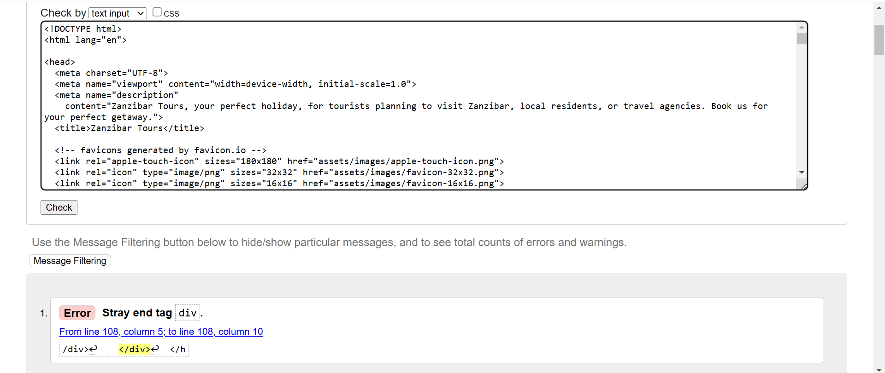
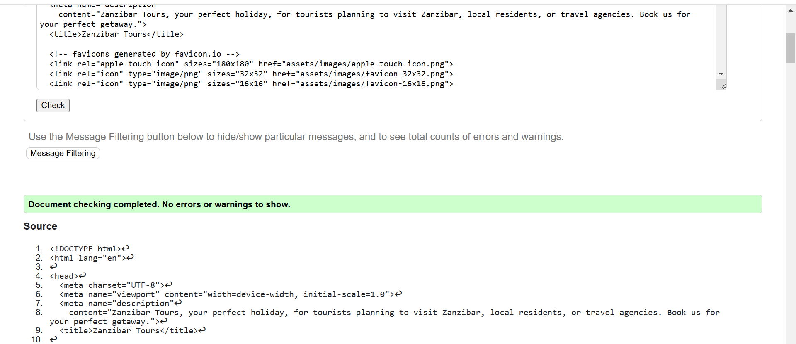
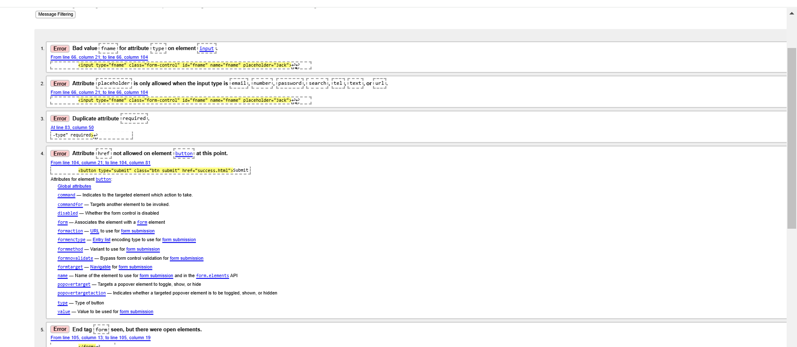
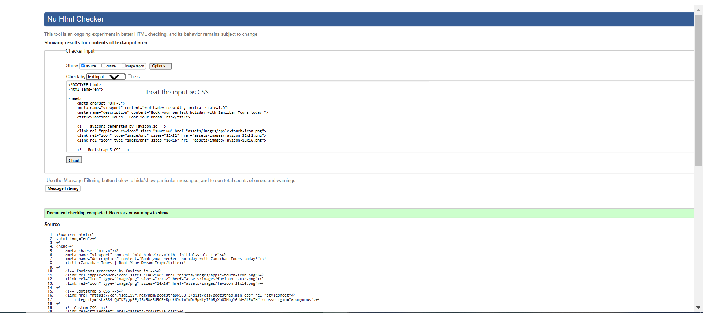

 ## Code Validation
To ensure code quality and identify major issues, each page undergoes validation. HTML was validated using [The W3C Markup Validation Service](https://validator.w3.org/) and CSS is validated using [CSS Jigsaw Validator](https://jigsaw.w3.org/css-validator/). 

### HTML

Click here  to view the HTML Validation 

To ensure the quality and compliance of our HTML pages, we utilized the[The W3C Markup Validation Service](https://validator.w3.org/) to identify and rectify any bugs. The tables below detail the validation process, including the specific errors detected, corresponding screenshots from the validator, the necessary corrections, and the implemented code amendments.

 
 
 **Page** | **Screenshot** | **Changes to be made** | **Changes made** | **Final result** 
---|---|---|---|---
 Home |  | Stray div | Removed stray div |  
 Book Now |  | The input type was set incorrectly.     The required attribute was duplicated,    The form method and action were written incorrectly. The form element was not closed correctly. | Changed the input type to 'text' to ensure the placeholder attribute functions correctly.    Removed the duplicate 'required' attribute.    Updated the form's method to 'GET' and set its action to 'confirmation.html'. Closed the form element correctly. |  
 

Click here  to view the CSS Validation 

 

