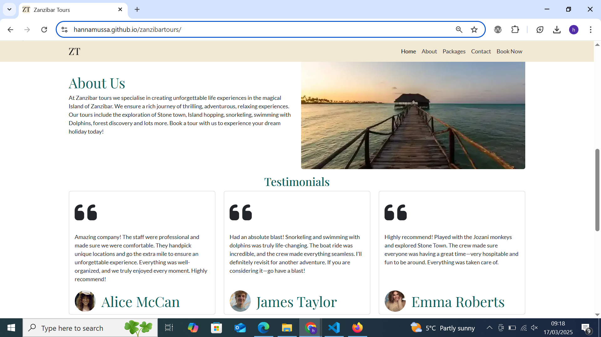
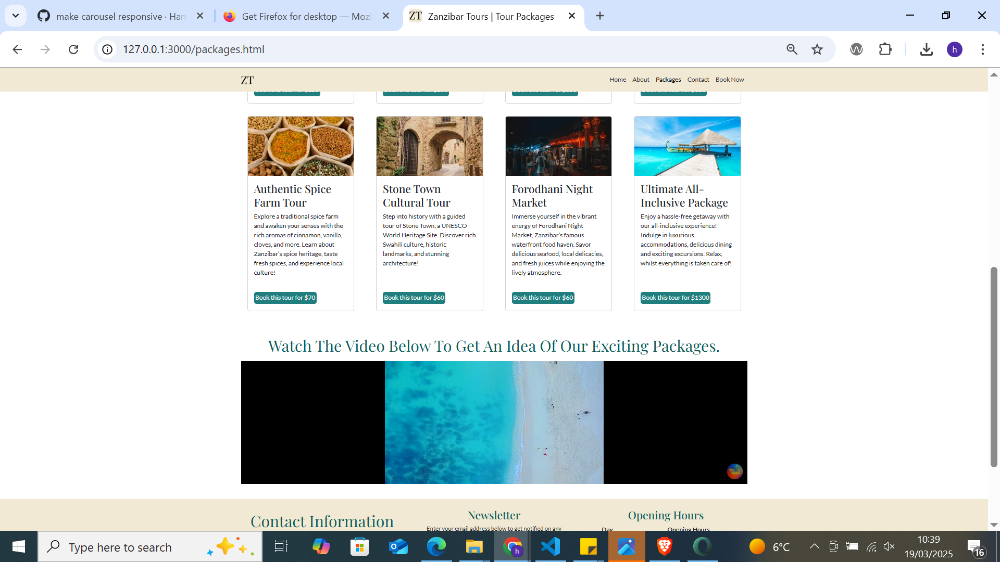
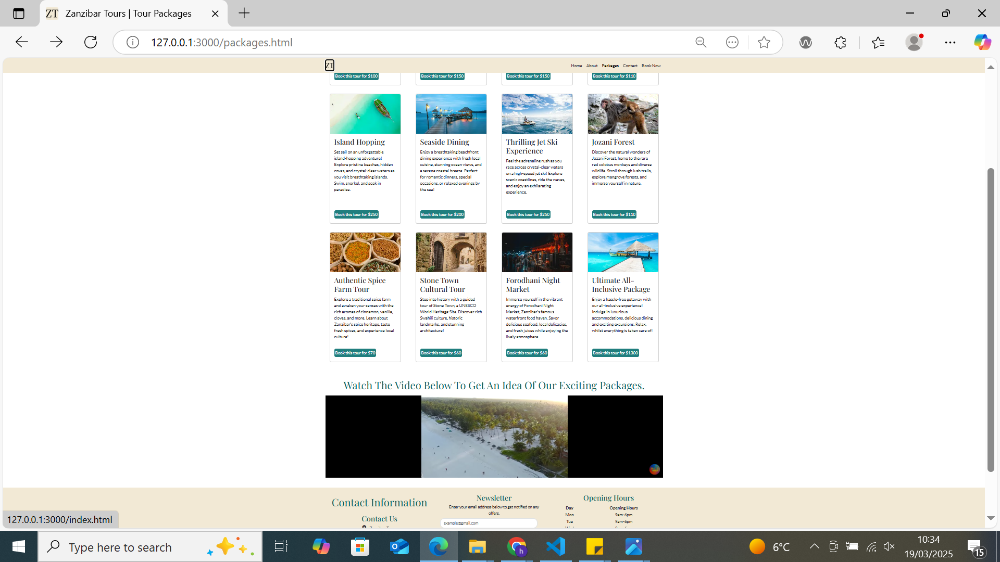
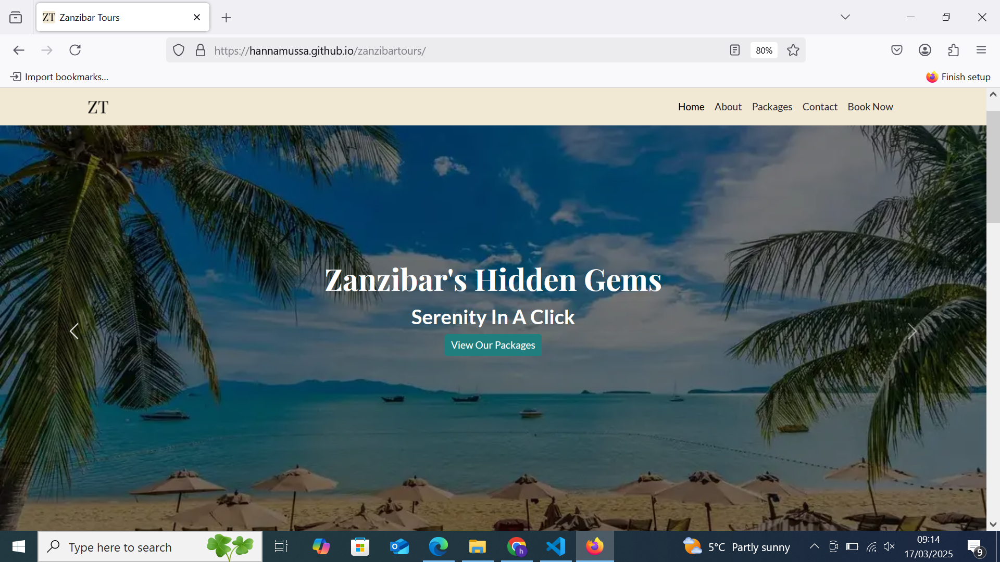
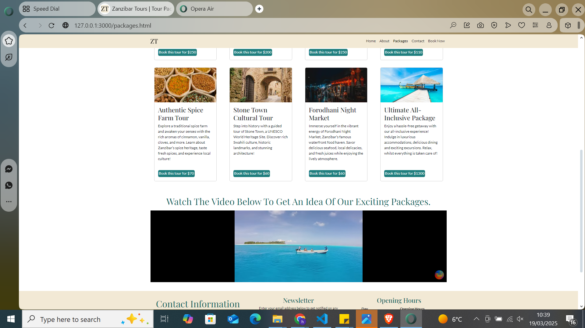
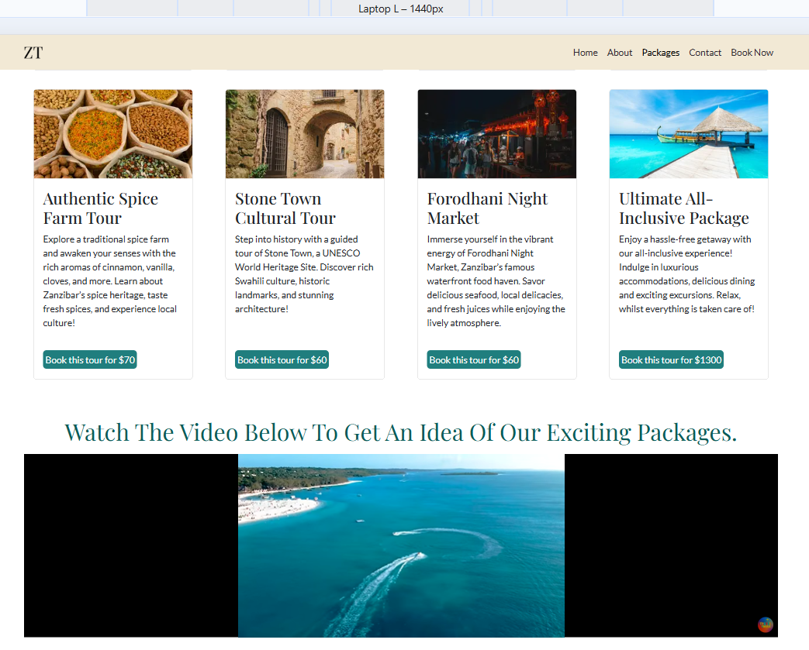
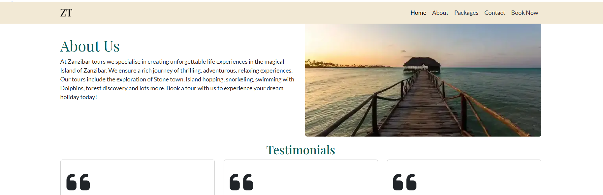
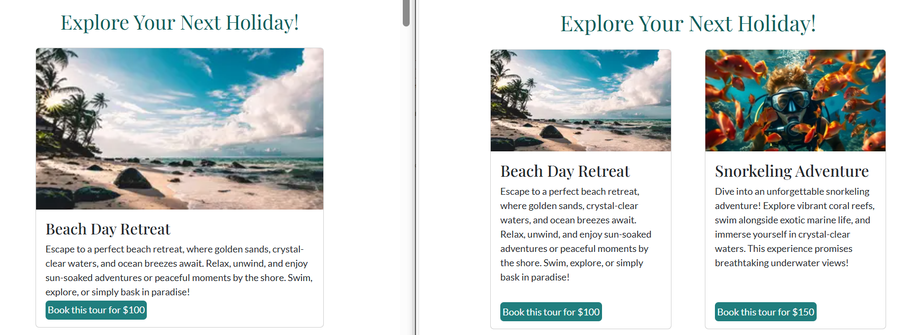
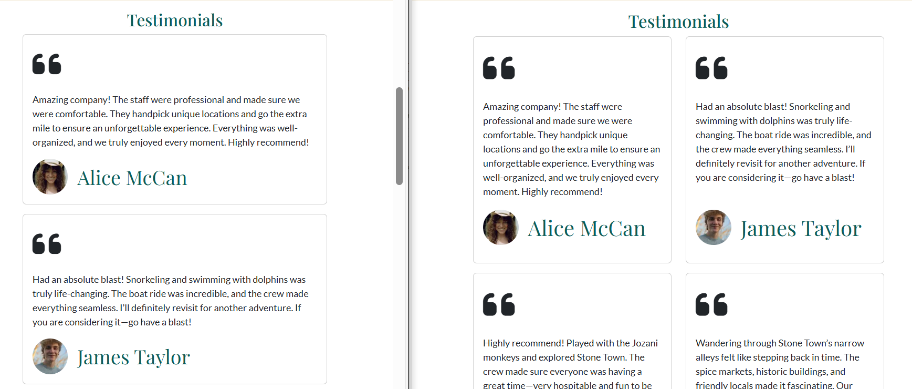

## Code Validation

To ensure code quality and identify major issues, each page is validated.

The tables below detail the validation process, including the specific errors detected, corresponding screenshots from the validator, the necessary corrections, and the implemented code amendments.

### HTML

Click here to view Index.html responsiveness testing results 

HTML was validated using [The W3C Markup Validation Service](https://validator.w3.org/).

| **Page** | **Screenshot**                                                                    | **Changes to be made**                                                                                                                                                                       | **Changes made**                                                                                                                                                                                                                                                         | **Final result**                                                                 |
| -------- | --------------------------------------------------------------------------------- | -------------------------------------------------------------------------------------------------------------------------------------------------------------------------------------------- | ------------------------------------------------------------------------------------------------------------------------------------------------------------------------------------------------------------------------------------------------------------------------ | -------------------------------------------------------------------------------- |
| Home     |    | Stray div                                                                                                                                                                                    | Removed stray div                                                                                                                                                                                                                                                        |    |
| Book Now |  | The input type was set incorrectly.    The required attribute was duplicated,    The form method and action were written incorrectly. The form element was not closed correctly. | Changed the input type to 'text' to ensure the placeholder attribute functions correctly.    Removed the duplicate 'required' attribute.    Updated the form's method to 'GET' and set its action to 'confirmation.html'. Closed the form element correctly. |  |

**Note:** The Packages page is not listed above because it passed the HTML validation without errors.

 

### CSS

Click here to view the CSS Validation 

CSS is validated using [CSS Jigsaw Validator](https://jigsaw.w3.org/css-validator/).

| **Page**       | **Screenshot**                                                                | **Changes to be made**                                     | **Changes made**                                               | **Updated Screenshot**                                                       |
| -------------- | ----------------------------------------------------------------------------- | ---------------------------------------------------------- | -------------------------------------------------------------- | ---------------------------------------------------------------------------- |
| CSS Stylesheet |  | Font-size and padding values were not correctly formatted. | Removed unnecessary padding and corrected the font-size value. |  |

 

## Browser Compatibility

The most commonly used browsers are Google Chrome, Microsoft Edge, Mozilla Firefox, Opera, and Brave. Thus, the website has been tested on these browsers—results are as follows.

Click here to view the Browser Compatibility 

| Browser         | Home (Top)                                                                          | Home (Bottom)                                                                       | Packages Page                                                                         | Booking Page                                                                         |
| --------------- | ----------------------------------------------------------------------------------- | ----------------------------------------------------------------------------------- | ------------------------------------------------------------------------------------- | ------------------------------------------------------------------------------------ |
| Google Chrome   |  |  |  |  |
| Microsoft Edge  |    |    |    |    |
| Mozilla Firefox |     |     |     |     |
| Opera           |   |   |   |   |
| Brave           |   |   |   |   |

**Note:** The website was responsive and displayed consistently across all tested browsers.

## Responsiveness

The website maintains a fully responsive layout across all devices, ensuring a seamless user experience on mobile, tablet, laptop, and XL screen.

Click here to view the Index.html responsiveness

| Device             | Mobile                                                                                  | Tablet                                                                                  | Laptop                                                                                  | XL Devices                                                                          |
| ------------------ | --------------------------------------------------------------------------------------- | --------------------------------------------------------------------------------------- | --------------------------------------------------------------------------------------- | ----------------------------------------------------------------------------------- |
| Index-Carousel     |     |     |     |     |
| Index-About        |   |   |   |   |
| Index-Testimonials |    |    |    |    |
| Index-Footer       |  |  |  |  |

Click here to view the Packages.html responsiveness

| Device        | Mobile                                                                                   | Tablet                                                                                   | Laptop                                                                                   | XL Devices                                                                           |
| ------------- | ---------------------------------------------------------------------------------------- | ---------------------------------------------------------------------------------------- | ---------------------------------------------------------------------------------------- | ------------------------------------------------------------------------------------ |
| Packages-Card |  |  |  |  |

Click here to view the Booking.html responsiveness

| Device       | Mobile                                                                                  | Tablet                                                                                  | Laptop                                                                                  | XL Devices                                                                          |
| ------------ | --------------------------------------------------------------------------------------- | --------------------------------------------------------------------------------------- | --------------------------------------------------------------------------------------- | ----------------------------------------------------------------------------------- |
| Booking Form |  |  |  |  |

## Lighthouse Audit

Chrome Lighthouse audits web pages for performance, accessibility, and SEO, generating reports and improvement suggestions.

Click here to view the Lighthouse Audit 

| Page     | Size    | Screenshot Before                                                               | Lighthouse Suggestions                                                  |     | Screenshot After                                                               |
| -------- | ------- | ------------------------------------------------------------------------------- | ----------------------------------------------------------------------- | --- | ------------------------------------------------------------------------------ |
| Home     | Mobile  |      |     |     |      |
| Home     | Desktop |     | Similar to above                                                        |     |     |
| Packages | Mobile  |   |  |     |   |
| Packages | Desktop |  | Similar to above                                                        |     |  |
| Booking  | Mobile  |    |   |     |    |
| Booking  | Desktop |   | Similar to above                                                        |     |   |

**Note:** All pages underwent image compression and resizing for improved performance.

 

## WAVE Web Accessibility Evaluation Tool

The [WAVE](https://wave.webaim.org/) tool analyzes structure, contrast, and accessibility issues, providing visual feedback for web pages.

Click here to view the WAVE Feedback 

| Before                                                                  | After                                                                  | Notes                                                                                                                                                                                                          |
| ----------------------------------------------------------------------- | ---------------------------------------------------------------------- | -------------------------------------------------------------------------------------------------------------------------------------------------------------------------------------------------------------- |
|  |  | The carousel headings had a contrast issue due to the background color. To resolve this, I applied background-color: rgba(0, 0, 0, 0.014) for better contrast. This update is reflected in the CSS stylesheet. |

**Note:** Since all other pages passed without issues, no additional screenshots are necessary.

 

## User Story Testing

Click here to view the User story testing Feedback 

| **User Story**                                                                                                                                                                                                                    | **Screenshot**                                                                              | **Result**                                                                                                                                                                                                                                 |
| --------------------------------------------------------------------------------------------------------------------------------------------------------------------------------------------------------------------------------- | ------------------------------------------------------------------------------------------- | ------------------------------------------------------------------------------------------------------------------------------------------------------------------------------------------------------------------------------------------ |
| As a new user, I would like to understand the purpose of this site for ease of convenience.                                                                                                                                       |                    | The About Us section provides a clear overview of Zanzibar Tours, highlighting its goal of delivering unforgettable holiday experiences.                                                                                                   |
| As a new user, I would like to easily navigate the site, as this would be user-friendly and convenient.                                                                                                                           |               | The website's fixed navigation menu ensures seamless access to key sections, including Home, About, Packages, Contact, and Book Now. Internal links provide smooth scrolling for quick access, enhancing user convenience.                 |
| As a new user, I would like to contact the owner and view their opening hours so I can contact them and discuss any questions.     As a new user, I would like to find social media pages for contact purposes.             |                   | The footer offers key contact details, social media links, and opening hours, ensuring easy access for inquiries and communication.                                                                                                        |
| As a new user, I would like to book a tour for convenience.                                                                                                                                                                       |                  | The website ensures a seamless booking experience with a prominently placed 'Book Now' button leading to a user-friendly form.                                                                                                             |
| As a new user, I would like to view visuals of Zanzibar Tours to know what I will be expecting.                                                                                                                                   |                 | The carousel showcases high-quality assets/images of Zanzibar Tours, providing users with a visual preview of destinations and experiences, helping them know what to expect before booking.                                               |
| As a new user, I would like to get detailed information on available tours with scenic visuals to know what I will be expecting.                                                                                                  |                 | The packages.html page offers detailed tour descriptions with scenic visuals, providing users with clear expectations. Each package includes a title, description, and pricing details.                                                    |
| As a new user, I would like to read testimonials from previous visitors to get an idea of the credibility of the company.                                                                                                         |                     | The website features a testimonials section where previous visitors share their experiences.                                                                                                                                               |
| As a new user, I would like to view the site on any device, as this would be a good user experience and convenient.                                                                                                               |                                                                                             | The website is designed to be fully responsive, ensuring a seamless experience across all devices. It adapts to different screen sizes, providing easy navigation and accessibility whether viewed on a desktop, tablet, or mobile device. |
| Since responsiveness was tested across multiple devices, no single screenshot is provided. For details, refer to the [TESTING.md](TESTING.md) file.                                                                               |
| As an existing user, I would like to stay updated and get notified about new features, events, and announcements to see if I would like to attend any tours.                                                                      |                   | The website's newsletter keeps users informed about new tours, events, and announcements, ensuring they stay updated on the latest offerings.                                                                                              |
| As an existing user, I would like to see any tours available with their costs so that I can calculate the feasibility before booking.                                                                                             |                 | The packages.html page displays all available tours along with their costs, allowing users to assess feasibility before booking.                                                                                                           |
| As an admin user, I should be able to respond to user inquiries to build a good reputation and ensure reliability.                                                                                                                |                  | The website enables admin users to respond to inquiries through a contact section, booking form, and provided contact details, ensuring timely communication, reliability, and a strong reputation.                                        |
| As an admin user, I want to add, edit, or remove tour listings so that the website always displays up-to-date offerings to provide a good user experience.                                                                        |            | The code provided enables administrators to add, edit, and remove tour listings, ensuring that the website remains up to date and provides users with accurate information.                                                                |
| As an admin user, I should be able to oversee site performance, detect issues, and debug any problems for a good user experience.     As an admin user, I should have correct indentation for easy readability and editing. |  | he code follows proper indentation for readability, making it easier to detect and debug issues.                                                                                                                                           |

## Bugs

Click here to view the Bugs 

| Bug                                                                                                | Solution Implemented                                                                          | Outcome Screenshot                                                                    |
| -------------------------------------------------------------------------------------------------- | --------------------------------------------------------------------------------------------- | ------------------------------------------------------------------------------------- |
| **Navbar difficult to access** – Users had to scroll to the top to navigate between pages.         | Added `fixed-top` to `<nav>` for a persistent navbar.                                         |                   |
| **Carousel text lacked contrast** – The text was hard to read against the background.              | Applied `background-color: rgba(0, 0, 0, 0.014)` to the header for better contrast.           |               |
| **Testimonial card not responsive** – Layout broke on different screen sizes.                      | Used media queries: Min-width 992px → height 25rem, Min-width 1200px → height 23rem.          |  |
| **Package card not responsive** – Content overflowed or misaligned on various devices.             | Standardized image sizes and ensured `
` elements had a similar word count for consistency. |  |
| **Booking form selector pre-selected by default** – Users could not start with an empty selection. | Added `selected disabled` to the "Select a tour" `<option>` to prevent auto-selection.        |            |

## Unfixed Bugs

- At this time, no known unresolved bugs have been identified
