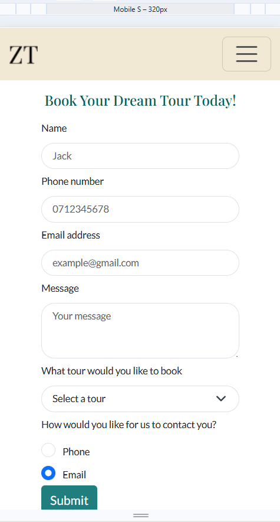

## Code Validation

To ensure code quality and identify major issues, each page undergoes validation. HTML was validated using [The W3C Markup Validation Service](https://validator.w3.org/) and CSS is validated using [CSS Jigsaw Validator](https://jigsaw.w3.org/css-validator/).

he tables below detail the validation process, including the specific errors detected, corresponding screenshots from the validator, the necessary corrections, and the implemented code amendments.

### HTML

Click here  to view the HTML Validation 

 
 
 **Page** | **Screenshot** | **Changes to be made** | **Changes made** | **Final result** 
---|---|---|---|---
 Home |  | Stray div | Removed stray div |  
 Book Now |  | The input type was set incorrectly.     The required attribute was duplicated,    The form method and action were written incorrectly. The form element was not closed correctly. | Changed the input type to 'text' to ensure the placeholder attribute functions correctly.    Removed the duplicate 'required' attribute.    Updated the form's method to 'GET' and set its action to 'confirmation.html'. Closed the form element correctly. | 

- The packages page is not included in the table above as it passed the HTML validation test.

 

Click here  to view the CSS Validation 

| **Page**        | **Screenshot**                                                              | **Changes to be made**                               | **Changes made**                                                        | **Updated Screenshot**                                                     |
| --------------- | --------------------------------------------------------------------------- | ---------------------------------------------------- | ----------------------------------------------------------------------- | -------------------------------------------------------------------------- |
| CSS style sheet |  | Font-size and padding values / format were incorrect | Padding removed as it was not necessary and font-size value was chnaged |  |
|                 |                                                                             |                                                      |

 

## Browser Compatibility

## Responsiveness

Click here  to view the Index.html responsiveness

| Device             | Mobile                                                                                  | Tablet                                                                                  | Laptop                                                                                  | XL Devices                                                                          |
| ------------------ | --------------------------------------------------------------------------------------- | --------------------------------------------------------------------------------------- | --------------------------------------------------------------------------------------- | ----------------------------------------------------------------------------------- |
| Index-Carousel     |     |     |     |     |
| Index-About        |   |   |   |   |
| Index-Testimonials |    |    |    |    |
| Index-Footer       |  |  |  |  |

Click here  to view the Packages.html responsiveness

| Device        | Mobile                                                                                   | Tablet                                                                                   | Laptop                                                                                   | XL Devices                                                                           |
| ------------- | ---------------------------------------------------------------------------------------- | ---------------------------------------------------------------------------------------- | ---------------------------------------------------------------------------------------- | ------------------------------------------------------------------------------------ |
| Packages-Card |  |  |  |  |

Click here  to view the Booking.html responsiveness

| Device       | Mobile                                                                                  | Tablet                                                                                  | Laptop                                                                                  | XL Devices                                                                          |
| ------------ | --------------------------------------------------------------------------------------- | --------------------------------------------------------------------------------------- | --------------------------------------------------------------------------------------- | ----------------------------------------------------------------------------------- |
| Booking Form |  |  |  |  |

## Lighthouse Audit

Chrome Lighthouse evaluates the performance, accessibility, and SEO of a web page by running audits, providing detailed reports, and suggesting improvements.

Click here  to view the Lighthouse Audit 

| Page     | Size    | Screenshot Before                                                               | Lighthouse Suggestions                                                  | Changes Made                                           | Screenshot After                                                               |
| -------- | ------- | ------------------------------------------------------------------------------- | ----------------------------------------------------------------------- | ------------------------------------------------------ | ------------------------------------------------------------------------------ |
| Home     | Mobile  |      |     | Resized & compressed images for faster loading         |      |
| Home     | Desktop |     | Similar to above                                                        | Resized & compressed images for faster loading         |     |
| Packages | Mobile  |   |  | Resized & compressed images for faster loading         |   |
| Packages | Desktop |  | Similar to above                                                        | Resized & compressed images for faster loading         |  |
| Booking  | Mobile  |    |   | Removed background image for contrast & faster loading |    |
| Booking  | Desktop |   | Similar to above                                                        | Removed background image for contrast & faster loading |   |

 

## WAVE Web Accessibility Evaluation Tool

The [WAVE](https://wave.webaim.org/) tool analyzes structure, contrast, and accessibility issues, providing visual feedback for web pages.

Click here  to view the WAVE Feedback 

 

## User Story Testing

## Bugs

## Unfixed Bugs
